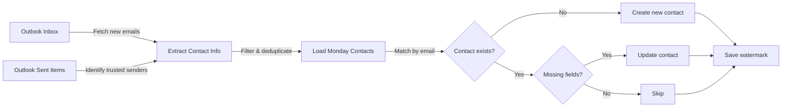

[](https://github.com/AlessioMartello/umbra-sync/actions/workflows/tests.yaml)
[](https://codecov.io/github/alessiomartello/umbra-sync)

# Umbra Sync

> Automatically sync contacts from Outlook to Monday.com — no manual copying required.

**Umbra Sync** bridges Microsoft Outlook and Monday.com by automatically extracting contact details from your emails (name, phone, LinkedIn, address, job title) and syncing them to a Monday.com board. Run it once to bootstrap your contacts, or schedule it as a recurring task to keep your database current.

## Why This Exists

Managing contacts across multiple platforms is tedious. You receive emails with contact information scattered throughout, but Monday.com has no native Outlook integration. This tool solves that by:

- **Extracting contact details** from email addresses, signatures, and message bodies
- **Filtering to trusted senders** only (contacts you've emailed first)
- **Avoiding duplicates** by matching on email address
- **Preserving existing data** by only updating empty fields in Monday.com
- **Remembering progress** through watermarking, so you only process new emails

## How It Works



The workflow is incremental: Umbra Sync remembers the last sync time and only processes new emails since then. It builds a "trust list" from your sent items, so it only adds contacts you've already communicated with—avoiding spam and outbound-only addresses.

## Architecture

### System Stack

| Component | Technology | Why |
|-----------|-----------|-----|
| **Runtime** | Python 3.12+ | Modern, typed, async-ready |
| **Email Source** | Microsoft Graph API + msal | Official Outlook 365 integration; refreshToken avoids password storage |
| **CRM** | Monday.com GraphQL API | Existing tool; no vendor lock-in for contacts |
| **Data Validation** | Pydantic | Type safety and schema enforcement |
| **HTTP Client** | httpx | Async/concurrent API calls |
| **Retry Logic** | tenacity | Exponential backoff for transient failures |
| **Testing** | pytest + respx | Fast unit tests with mocked HTTP responses |
| **Tooling** | uv + mise | Reproducible dev environment; fast installs |

### Code Organization

```
umbra-sync/
├── src/main.py                 # Orchestration: fetch, transform, sync
├── src/clients/
│   ├── outlk.py               # Outlook API wrapper (pagination, auth)
│   └── mday.py                # Monday API wrapper (GraphQL mutations)
├── src/utils/
│   ├── data_models.py         # Pydantic Contact schema
│   ├── transforms.py          # Email parsing, deduplication, filtering
│   ├── watermark.py           # Last-sync timestamp storage
│   ├── retry_strategy.py      # @api_retry_strategy decorator
│   ├── logger.py              # Structured logging
│   └── monitoring.py          # Job summary reporting
└── tests/                      # Comprehensive unit tests
```

### Key Design Decisions

1. **Async/await throughout** — Concurrent API calls reduce total runtime (outlook inbox + sent items fetched in parallel)
2. **Watermarking** — Only new emails processed; watermark survives restarts and crashes
3. **Trust-list filtering** — Reduces noise; only contacts you've emailed are synced
4. **Selective updates** — Never deletes Monday fields; only fills empty ones
5. **Continuation on error** — One bad email doesn't crash the whole sync; continues to next email

## Getting Started

### Prerequisites

- **Python 3.12+**
- **[mise](https://mise.jdx.dev/)** — manages Python and `uv` versions
- **[uv](https://docs.astral.sh/uv/)** — installs dependencies
- **Microsoft Outlook 365** account (personal or work)
- **Monday.com** workspace and board

### Install

```bash
git clone https://github.com/AlessioMartello/umbra-sync
cd umbra-sync

# mise installs Python 3.12 and uv automatically
mise install

# Install dependencies
uv sync
```

### Configure API Credentials

Create a `.env` file in the project root:

```env
# Azure / Outlook
AZURE_CLIENT_ID=xxxxxxxx-xxxx-xxxx-xxxx-xxxxxxxxxxxx
REFRESH_TOKEN=MCwCA...

# Monday.com
MONDAY_API_KEY=eyJhbGc...
MONDAY_BOARD_ID=1234567890

# Optional
DEBUG=false
```

**Getting credentials:**

| Credential | Source | Steps |
|-----------|--------|-------|
| `AZURE_CLIENT_ID` | [Azure Portal](https://portal.azure.com) | App Registrations → New → Copy Client ID |
| `REFRESH_TOKEN` | Outlook OAuth | Use msal library to generate one-time |
| `MONDAY_API_KEY` | Monday.com | Settings → API → Create API Token |
| `MONDAY_BOARD_ID` | Monday.com | Open your contact board; ID is in the URL (e.g., `board/12345`) |

### Run

```bash
# One-time sync (creates/updates contacts in Monday.com)
python src/main.py

# Dry-run mode (preview changes without writing)
python src/main.py --dry-run

# Debug mode (verbose logging)
python src/main.py --debug

# Combine flags
python src/main.py --dry-run --debug

# Run tests
pytest

# Format & lint
ruff format src/ tests/
ruff check --fix src/ tests/
```

#### Understanding Dry-Run

The `--dry-run` flag lets you preview what the sync will do **without making changes:**

```bash
$ python src/main.py --dry-run
... (normal sync process)
[DRY RUN] Skipping contact creation
[DRY RUN] Skipping contact updates
[DRY RUN] Skipping watermark update
```

Useful for:
- **Testing configuration** — verify API credentials and contacts are being extracted correctly
- **Before scheduling** — run once to preview results before setting up a cron job
- **Debugging issues** — see what *would* be synced without polluting your Monday board
- **Validating new contacts** — check that contact parsing is working as expected

## Customization

### Monday.com Board Schema

Edit column IDs in [src/clients/mday.py](src/clients/mday.py) to match your board:

```python
FIELD_TO_COLUMN_ID = {
    "phone": "phone",                  # Standard column
    "linkedin": "text_mm274aw7",       # Your custom column ID
    "address": "text_mm2jnfn5",
    "website": "text_mm2jf3vf",
    "job_title": "text0",
}
```

Get column IDs from Monday.com GraphQL API or inspect the board settings.

### Watermark / Sync State

Watermark (last sync timestamp) is stored in `.watermark` (production) and `.watermark_debug` (debug mode). Delete to force a full resync:

```bash
rm .watermark
python src/main.py  # Reprocess all emails
```

## Implementation Details

### Data Model

[src/utils/data_models.py](src/utils/data_models.py) defines the `Contact` schema:

```python
class Contact(BaseModel):
    email_address: EmailStr          # Validated email
    name: str                        # Required, min 1 char
    phone: Optional[str] = None
    linkedin: Optional[str] = None
    monday_id: Optional[str] = None  # Monday.com item ID
    address: Optional[str] = None
    job_title: Optional[str] = None
    website: Optional[str] = None
```

### Retry & Error Handling

- **Transient API failures** → Retry with exponential backoff (tenacity)
- **Individual email parsing errors** → Log warning, continue to next email
- **Critical auth failures** → Exit immediately with error

The `@api_retry_strategy` decorator handles retries in [src/utils/retry_strategy.py](src/utils/retry_strategy.py).

### Logging

Structured logs in [src/utils/logger.py](src/utils/logger.py):

```python
from utils.logger import get_logger
logger = get_logger(__name__)

logger.info("Fetching Outlook inbox")
logger.warning("Contact email invalid, skipping")
logger.error("Failed to update Monday contact", exc_info=True)
```

## Troubleshooting

| Issue | Cause | Fix |
|-------|-------|-----|
| No contacts synced | Old watermark; empty inbox | `rm .watermark && python src/main.py` |
| Duplicate contacts | Email matches multiple Outlook items | Contacts matched by email; check for duplicates in Outlook |
| Missing fields in Monday | Contact already exists but fields empty | Tool only updates missing fields (preserves existing) |
| "Unauthorized" error | Invalid credentials | Verify `AZURE_CLIENT_ID`, `REFRESH_TOKEN`, `MONDAY_API_KEY` in `.env` |
| Sync hangs | Large inbox; pagination timeout | Reduce inbox size or check network stability |

## Contributing

Contributions welcome! To contribute:

1. Fork the repository
2. Create a feature branch (`git checkout -b feature/xyz`)
3. Make changes and add tests
4. Run: `pytest`, `ruff format .`, `ruff check .`
5. Commit with clear messages
6. Open a pull request

## License

MIT License — see [LICENSE](LICENSE) for details.
